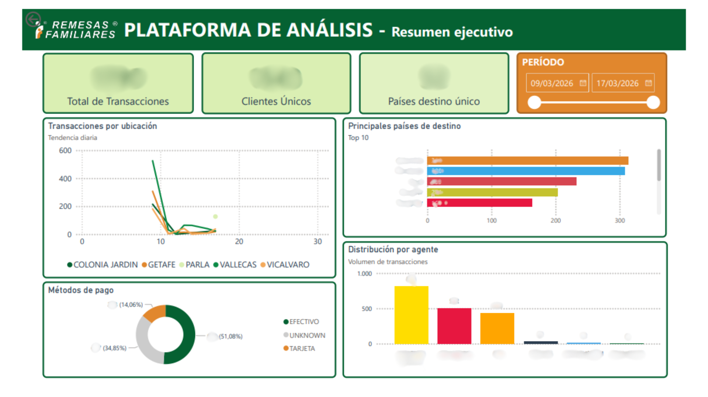
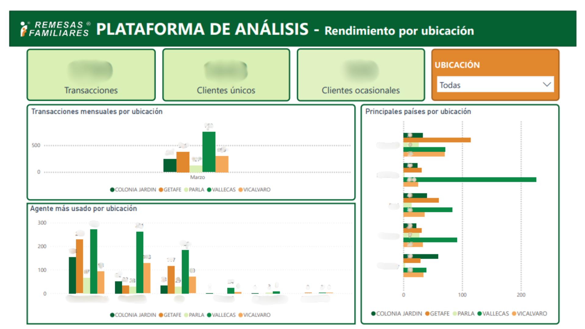
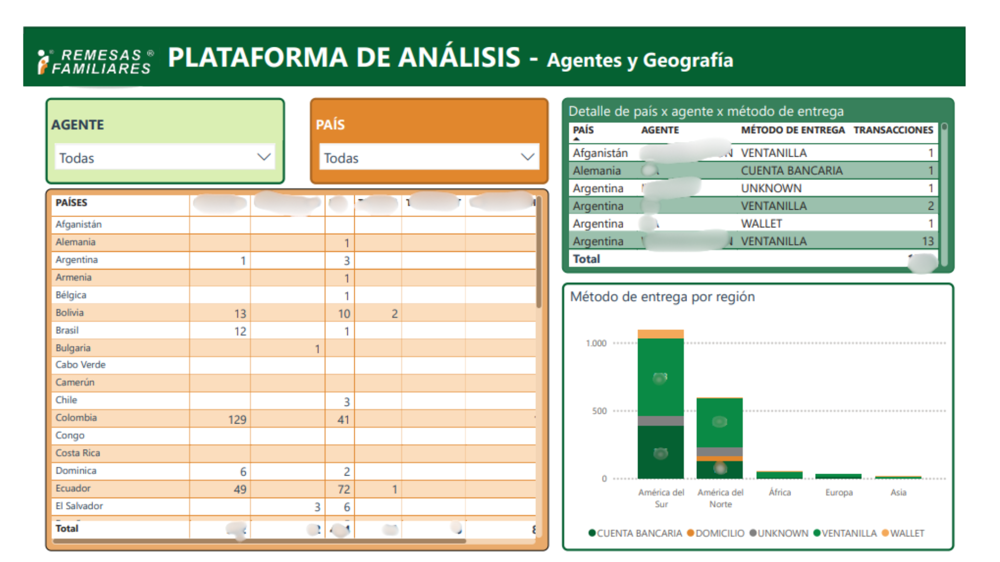
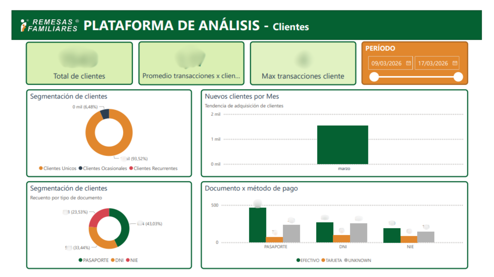
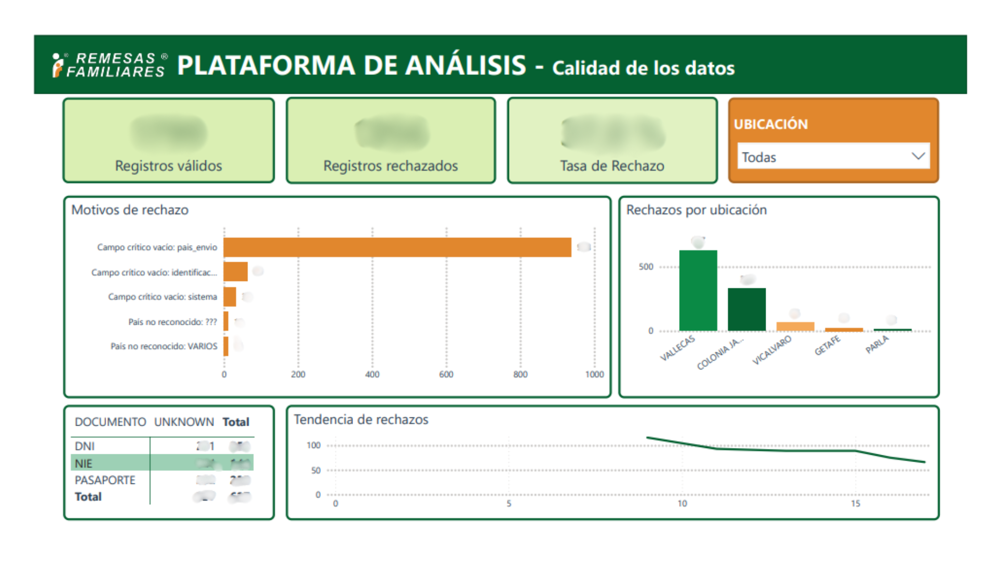

# ETL Pipeline — Remittance Analytics Platform

**Automated data pipeline for centralizing and analyzing remittance transactions across multiple locations**

> ⚠️ **Note**: This repository contains a real production project. All dashboard screenshots have been blurred to protect business confidentiality.

---

## The Business Problem

A remittance company operating **5 locations** managed its transaction records completely in isolation — each location handled its own data independently with no connection to the others.

### Pain Points

- **Zero consolidated visibility** — no way to see overall business performance in one place
- **Inconsistent data** — operators recorded countries, agents and payment methods differently across locations
- **No centralized history** — data was siloed per location, making cross-location analysis impossible
- **Manual consolidation** — someone had to manually gather and reconcile data every day, prone to errors and omissions

### The Impact

Every business decision was based on incomplete, inconsistent, or outdated data. There was no way to answer basic questions like:
- Which agent processes the most transactions?
- Which countries receive the most remittances?
- Are customers coming back?
- Which location has the most data quality issues?

---

## The Solution

A fully automated ETL pipeline that processes daily transactions from all locations, centralizes them in a PostgreSQL data warehouse, and serves them to a Power BI dashboard.

```
5 Independent Locations
   Each location operates its own transaction management system
        ↓
   Extractor
   ├─ Automatic structure detection
   └─ Incremental extraction — new records only
        ↓
   Transformer
   ├─ Typo correction with fuzzy matching
   ├─ Normalization against master catalogs
   ├─ Document classification (ID types)
   ├─ SHA-256 anonymization — zero PII stored
   ├─ Country enrichment (ISO code, region, official name)
   └─ Rejection with logged reason for operator review
        ↓
   Loader
   ├─ Star Schema dimensional model
   ├─ Bulk upsert optimized for high-cardinality dimensions
   ├─ In-memory dimension cache
   └─ Idempotent — re-runs never duplicate data
        ↓
PostgreSQL serverless
        ↓
Power BI Desktop
```

---

## Architecture

### Data Model

```
FACT_TRANSACTIONS (central fact table)
├── DIM_DATE              → Calendar table 2025-2030
├── DIM_LOCAL             → The 5 locations
├── DIM_COUNTRY           → Countries with ISO code and region
├── DIM_AGENT             → Remittance agents
├── DIM_DELIVERY_METHOD   → Delivery methods
├── DIM_PAYMENT_METHOD    → Payment methods
└── DIM_CUSTOMER          → Anonymized customers (SHA-256 hash only)

STAGING
└── RAW_TRANSACTIONS      → Raw data for traceability

LOGS
├── ETL_PROCESS           → Execution history with metrics
└── REJECTED_ROWS         → Rejected records with rejection reason
```

### Analytics Views (Power BI layer)

```
analytics/
├── vw_transactions_dashboard    → One row per transaction, all dimensions resolved
├── vw_local_summary             → Transactions and unique customers by location/month
├── vw_customer_behavior         → Customer segmentation (First Visit/Occasional/Recurring)
├── vw_agent_summary             → Agent × country × month breakdown
├── vw_document_payment_profile  → Document type × payment method cross-analysis
└── vw_rejection_summary         → Rejection reasons by location and date
```

---

## Key Technical Features

### Automatic Data Correction
Three-level correction pipeline before rejecting any record:

1. **Exact alias** — normalizes known variations to canonical values
2. **Fuzzy matching** — catches typos and near-matches (rapidfuzz WRatio, 80% threshold)
3. **Country aliases** — colloquial names resolved to official ISO names

### Real Incremental Extraction
The extractor queries `fact_transactions` before processing each source and filters already-loaded records:
- Re-runs never duplicate data
- Previously rejected records are automatically reprocessed once the operator corrects them
- Daily ETL only processes what's new

### Customer Anonymization
Zero PII reaches the warehouse:
- Name and phone: discarded in transformer
- Only stored: document type + irreversible hash

### Idempotency
`UNIQUE (local_key, source_row_id)` constraint on `fact_transactions` guarantees the same record is never inserted twice regardless of how many times the ETL runs.

### Performance Optimization
- **Bulk upsert** for high-cardinality dimensions — reduced from thousands of individual queries to 2 queries per batch
- **In-memory cache** for low-cardinality dimensions
- **Single read operation** per source — all filtering happens in memory

---

## Dashboard — Power BI

> Screenshots blurred to protect business confidentiality.

### Page 1 — Executive Summary
Overview of total transactions, unique customers, destination countries, trends over time, top agents and top destination countries.



### Page 2 — Locations
Side-by-side performance comparison across all locations — transactions per month, preferred agents per location, recurring customers per location.



### Page 3 — Agents & Geography
Agent × country matrix with conditional formatting heatmap, delivery method breakdown by region, detailed agent × country × delivery method table.



### Page 4 — Customers
Customer segmentation (First Visit / Occasional / Recurring), customers by month trend, document type breakdown, document type × payment method cross-analysis.



### Page 5 — Data Quality
Rejection reasons ranking, rejections by location, unknown payment methods by document type, rejection trend over time.



---

## Results

### Before vs. After

| Metric | Before | After |
|---|---|---|
| Business visibility | Siloed per location | Consolidated in real time |
| Data quality | Inconsistent, manual | Validated and auto-corrected |
| Consolidation | Manual, error-prone | Fully automated daily |
| Customer privacy | Unprotected PII | Complete SHA-256 anonymization |
| History | Isolated per location | Centralized and comparable |

---

## Tech Stack

| Component | Technology |
|---|---|
| Language | Python 3.11 |
| Database | PostgreSQL serverless |
| Fuzzy correction | rapidfuzz |
| Automation | GitHub Actions (daily schedule) |
| Visualization | Power BI Desktop |

---

## Project Structure

```
├── main.py                          # Pipeline orchestrator
├── config/
│   ├── settings.py                  # Environment config
│   └── master_data.py               # Catalogs, aliases and validation rules
├── src/
│   ├── etl/
│   │   ├── extractor.py             # Incremental extraction
│   │   ├── transformer.py           # Validation, correction and anonymization
│   │   └── loader.py                # Optimized loading to staging and warehouse
│   ├── utils/
│   │   ├── db.py                    # PostgreSQL connection pool
│   │   ├── logger.py                # ETL execution logging to DB
│   │   ├── document_classifier.py   # ID document type classification
│   │   ├── validator.py             # Alias and fuzzy matching validation
│   │   ├── sheets_validator.py      # Source structure validation
│   │   └── country_resolver.py      # Country resolution against ISO catalog
│   └── seeders/
│       └── dim_date_seeder.py       # Populate dim_date
├── data/
│   └── countries.csv                # Country catalog with translations in 11 languages
├── sql/
│   └── create_schema.sql            # Full database schema
├── .github/
│   └── workflows/
│       └── etl.yml                  # Daily automation
├── .env.example                     # Environment variables template
└── requirements.txt                 # Python dependencies
```

---

## Setup

```bash
python -m venv venv
source venv/bin/activate      # Linux/Mac
venv\Scripts\activate         # Windows

pip install -r requirements.txt

cp .env.example .env
# Fill .env with your credentials (see Environment Variables below)

psql -f sql/create_schema.sql         # Create database schema
python src/seeders/dim_date_seeder.py  # Populate date dimension (first time only)

python main.py
```

### Environment Variables

| Variable | Description |
|---|---|
| `DB_HOST` | PostgreSQL host |
| `DB_NAME` | Database name |
| `DB_USER` | Database user |
| `DB_PASSWORD` | Database password |
| `DB_PORT` | Database port (default: 5432) |
| `SOURCE_CREDENTIALS_FILE` | Path to source service account credentials JSON |
| `ID_LOCAL_1` to `ID_LOCAL_5` | ID's URL for each location |

---

## Automation

The ETL runs automatically every day in the early morning hours via GitHub Actions. Each execution logs metrics (extracted, processed, rejected, duration) both in GitHub Actions and in `logs.etl_process` in the database. If a run fails, an email notification is sent automatically.

---

> 📌 This project is part of a professional portfolio. It is not open for external contributions or redistribution.

**Built by [Daniel Almeida](https://www.linkedin.com/in/daniel-almeida-475a6b319/)**